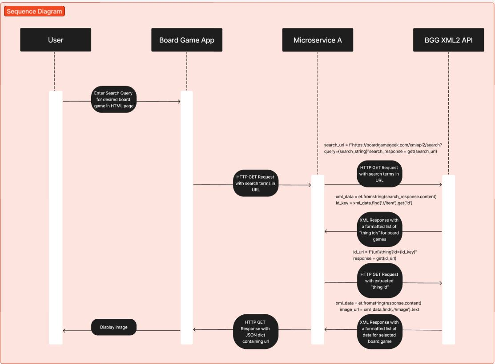

The program will REQUEST data from this microservice by sending an HTTP GET
request, saving the response, and parsing JSON response for the requested
URL.

Specifically, the calling program will send an HTTP GET request with no 
JSON payload, just the search terms at the end of the URL, like so:

response = requests.get(f"http://localhost:5000/api/get_url/{search_string}")

The HTTP GET response will include a JSON payload, from which the URL will be
extracted, like so:

url_string = response.json().get('url')

The microservice will always return a JSON dictionary with just one key-value
pair for the URL.

